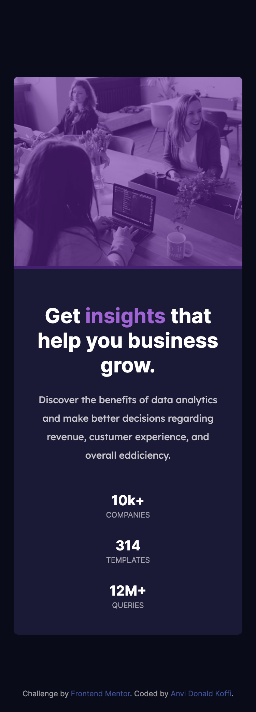

# Frontend Mentor - Stats preview card component solution

This is a solution to the [Stats preview card component challenge on Frontend Mentor](https://www.frontendmentor.io/challenges/stats-preview-card-component-8JqbgoU62).

### The challenge

Users should be able to:

- View the optimal layout depending on their device's screen size

### My solution (image)

### Links

- Solution URL: [My solution](https://www.frontendmentor.io/solutions/statistics-preview-card-component-using-only-html-and-css-NPWQGmLDN).
- Live Site URL: [Live site](https://anviwarehouse.github.io/stats-preview-card-component/).

### My process

I started this project in the simplest way possible.
First, I went through the resources provided to see what I had. Then, I thought the project; let's say the structure of it in "my head" 😅.Once everything was well thought out, I started the development.
It was a great experience 🎉🙂.

### Built with

- Semantic HTML5 markup
- CSS variables
- CSS Flexbox
- BEM notation

### What I learned

I learned how to start a project from a basic structure as well as how to analyze the resources provided